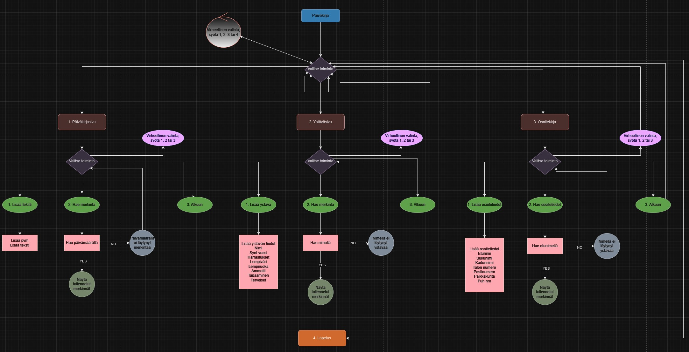

# Päiväkirja

Päiväkirja on sovellus, johon käyttäjä voi tallentaa päiväkirjamerkintöjä.

Käyttäjä kirjoittaa halauamansa tekstin ja teksti tallennetaan tiedostoon paivakirja.txt

Sovelluksessa voidaan tarkastella aiempia merkintöjä päivämäärän perusteella.

Päiväkirja sisältää päiväkirjasivujen lisäksi ystäväsivut, joihin ystävät voivat täyttää tietoja, kuten nimi, harrastukset

ja lempiasiat, sekä osoitekirjasivun, johon voi tallentaa osoitetietoja.

Etsimme materiaalia ohjelmoinnin toteutukseen eri lähteistä (esim. Mooc, W3School ja Chatgpt ideointiin).

Lähdimme suunnittelemaan mitä osia sovellus tulee sisältämään ja tämän jälkeen lähdimme kokoamaan koodia suunnitelman perusteella.

## Käynnistysohje

1. Run Python file

2. Valitse toiminto 1 - Päiväkirja, 2 - Ystäväsivu, 3 - Osoitekirja tai 4 - Lopetus.

3. Jos valitset 1 - Päiväkirja, valitse toiminto: 1 - Lisää teksti, 2 - Hae merkintä tai 3 - Alkuun.

    <ul>
    <li>Jos valitset 1 - Lisää teksti: Lisää päivämäärä ja lisää teksti.</li>
    <li>Jos valitset 2 - Hae merkintä: Hae merkintä päivämäärällä.</li>
    <li>Jos valitset 3 - Alkuun: Palaat takaisin päävalikkoon, Valitse 1, 2, 3, tai 4.</li>
    <li>Jos valitset jonkun muun numeron kuin 1-3, ohjelma ilmoittaa virheellisestä valinnasta ja palauttaa takaisin päävalikkoon.</li>  
    </ul>
    

4. Jos valitset 2 - Ystäväsivu, valitse toiminto: 1 - Lisää ystävä, 2 - Hae merkintä tai 3 - Alkuun.

    <ul>
    <li>Jos valitset 1 - Lisää ystävä: Lisää nimi, syntymävuosi, harrastukset, lempiväri, lempiruoka, ammatti, tapaaminen ja terveiset.</li>
    <li>Jos valitset 2 - Hae merkintä: Hae merkintä nimellä.</li>
    <li>Jos valitset 3 - Alkuun: Palaat takaisin päävalikkoon, Valitse 1, 2, 3, tai 4.</li>
    <li>Jos valitset jonkun muun numeron kuin 1-3, ohjelma ilmoittaa virheellisestä valinnasta ja palauttaa takaisin päävalikkoon.</li>
    </ul>

5. Jos valitset 3 - Osoitekirja, valitse toiminto: 1 - Lisää osoitetiedot, 2 - Hae osoitetiedot tai 3 - Alkuun.

    <ul>
    <li>Jos valitset 1 - Lisää osoitetiedot: Lisää etunimi, sukunimi, kadun nimi, talon numero, postinumero, paikkakunta, puhelinnumero.</li>
    <li>Jos valitset 2 - Hae osoitetiedot: Hae etunimellä.</li>
    <li>Jos valitset 3 - Alkuun: Palaat takaisin päävalikkoon, Valitse 1, 2, 3, tai 4.</li>
    <li>Jos valitset jonkun muun numeron kuin 1-3, ohjelma ilmoittaa virheellisestä valinnasta ja palauttaa takaisin päävalikkoon.</li>
    </ul>

6. Jos valitset 4 - Lopetus: Ohjelma sulkeutuu ja saat tekstin "Näkemiin, toivottavasti nähdään huomenna!".

7. Jos valitset jonkun muun numeron kuin 1-4, ohjelma ilmoittaa virheellisestä valinnasta ja palauttaa takaisin päävalikkoon.

## Vuokaavio

## Linkki videoesittelyyn
